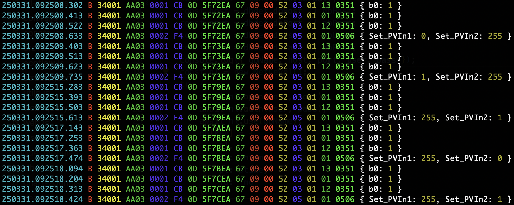

A swiss army knife for data extraction and analysis of power system log files

## ** Warning **

Messing with power hardware is risky.
Poking dodgy wires in strange holes can wake giants.
This code is *highly* experimental and based on tons of guesswork.
This is an incomplete list of possible dangers, but ...
If you burn down your house / garage / bunker or release the magic smoke from your kit, that's on you.
You have been warned.

**Walk away now if this makes you uncomfortable.**

## Reason

* Local control and freedom from the tyranny of the cloud
* [It's the only way forward](https://forum.grid.space/t/ecoflow-powerkit-canbus-hack/2457/1)

## Focus

* Extracting and decoding EcoFlow CANbus log files
* Replay of discrete user events to control devices via CANbus

## Future

Related hardware: solar generators, inverters, etc

## Requirements

* clone this repo (git skills)
* nodejs 20 or newer (and knowing what that is)
* raspberry pi with a CAN adapter (or windows equivalent)
* any EcoFlow product with a CAN bus
* patience, curiosity, grit, and a dash of outrage

## SorryNotSorry

Wattzup is written in Javascript. There is no Python here.

## First Time Setup

```
git clone https://github.com/gridspace/wattzup
npm run setup
```

## Using the `canlog` tool

let's jump right into the deep end with an example of processing some PowerKit can log files to look for PV input toggle events. `canlog` takes either a pipe of data from stdin (with the `-` argument) or a single file name. this example cats the output of several files into `canlog`

```
cat <filelist> | node lib/canlog - \
    --rec \
    --chan=B \
    --typs=A3:05,A3:50,F4:05,F4:50,CB:03 \
    --nodes=34001,50001 \
    --dvs4=0351,0506
```

this prints the headers and records (`--rec`) for messages that match *all* critera:
* channel `B` messages
* any of several given record types
* any of several given node ids
* any of several given dv4 ids

`canlog` defaults to the `candump` log format. if you want to use the `.csv` format produced by SavvyCAN, then use the `--csv` command line option.

see [canlog usage](./docs/canlog-usage.md) for more details



## Explore

use the `--hex` option to print the raw payloads.
when you isolate a stream using `--str`, add `--hex=diff` to show values changing over time.
use the `--pivot` feature and dump data into a google sheets table to find user events in the streams of data. this requires a whole todo of its own.

## Contributing

* adding record types to [lib/structs.json](lib/structs.json)
* setup processes for getting CAN data out of devices
* sample log files for new devices

## Related Information

* [EcoFlow Power Link CAN wiring](https://manuals.ecoflow.com/us/product/power-link?lang=en_US)
* [EcoFlow J1939 CAN protocol](https://websiteoss.ecoflow.com/cms/upload/2024/11/13/EcoFlow%20J1939%20Protocol_V1.02_20241112_1731460673096.pdf)
* [EcoFlow-CanBus-Reverse-Engineering](https://github.com/bulldog5046/EcoFlow-CanBus-Reverse-Engineering)
